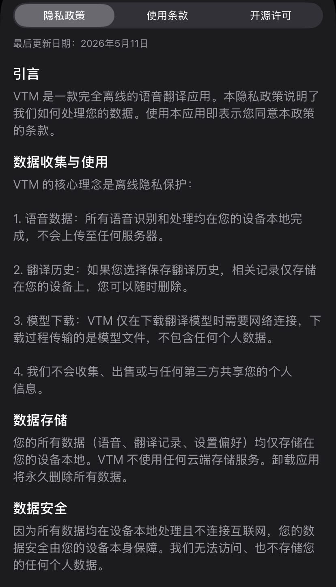
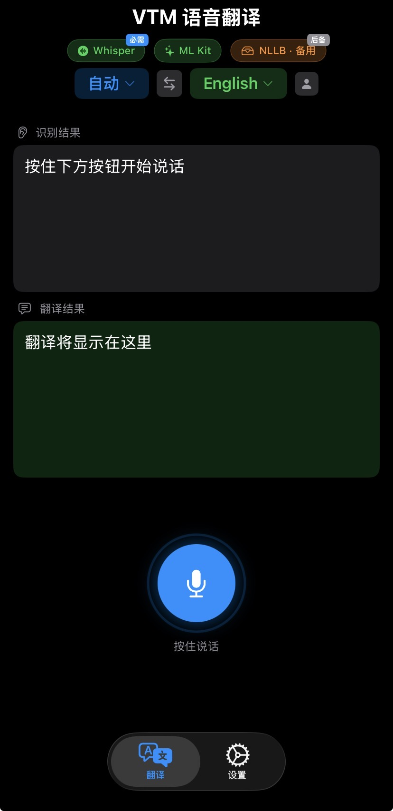
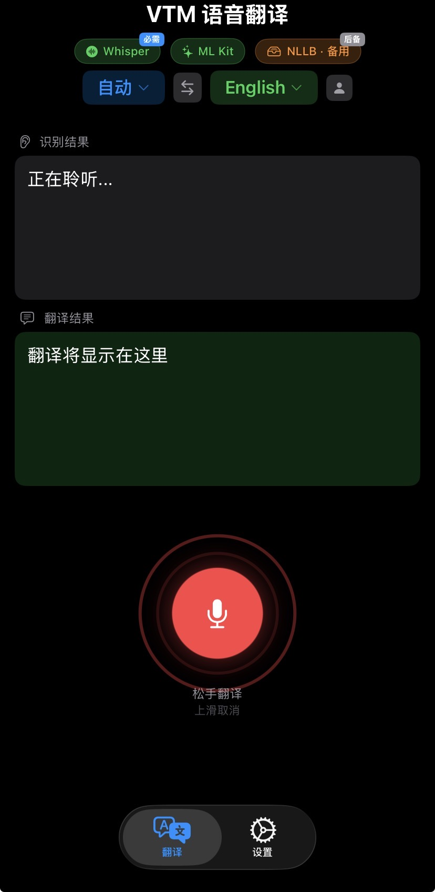
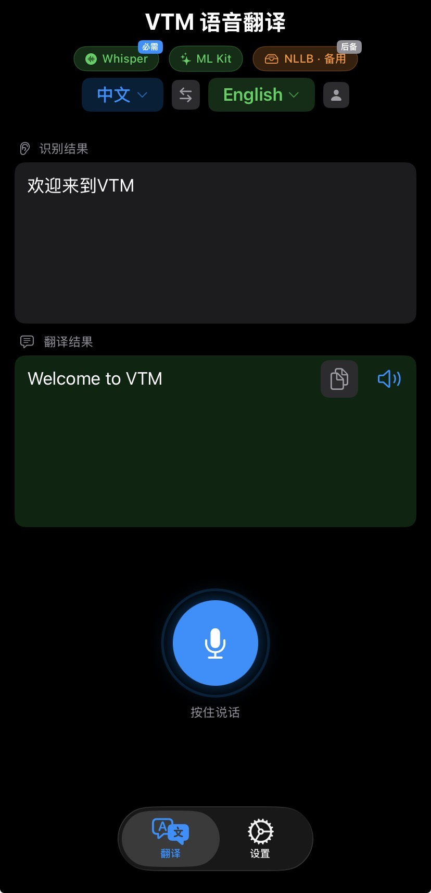

# VTM — Voice Translation Mate

[](LICENSE)
[]()

**Fully offline voice translation app for iOS.**  
No internet required for translation. All processing happens locally on your device.

---

## Features

- 🎤 **Real-time voice recognition** — OpenAI Whisper (ggml), 99 languages
- 🌐 **Multilingual translation** — Google ML Kit (zh↔en) + Meta NLLB-200 ONNX (200 languages)
- 🔊 **Text-to-speech** — Native AVSpeechSynthesizer with natural pronunciation
- 🔒 **100% offline** — No data collection. No tracking. Everything stays on your device.
- 🌍 **5 UI languages** — 中文 / English / 日本語 / 한국어 / Français
- 🎨 **Dark mode** — System / Light / Dark
- 📱 **Siri integration** — "Translate with VTM" shortcut

---

## Screenshots

<div align="center">
  
  
  
  
</div>

---

## Architecture

| Engine | Framework | License | Size |
|--------|-----------|---------|------|
| Speech Recognition | [Whisper.cpp](https://github.com/ggerganov/whisper.cpp) (ggml) | MIT | ~466 MB |
| Primary Translation | [Google ML Kit](https://developers.google.com/ml-kit) | Apache 2.0 | ~30 MB |
| Backup Translation | [NLLB-200](https://github.com/facebookresearch/fairseq) (ONNX) | MIT | ~940 MB |
| TTS | AVSpeechSynthesizer (Apple) | Built-in | — |
| Inference | Metal / Core ML | Built-in | — |

**Smart memory management**: Whisper and NLLB never occupy memory simultaneously (~940 MB peak).

---

## User Guide

📖 [Download PDF User Guide](VTM-User-Guide.pdf) (Chinese)

---

## Requirements

- iOS 17.4+
- Xcode 26+
- CocoaPods
- ~1.5 GB free storage (for all models)

---

## Getting Started

### 1. Clone

```bash
git clone https://github.com/Laenpo/VTM.git
cd VTM
```

### 2. Download Frameworks

You need pre-built frameworks for Whisper.cpp and ONNX Runtime.

**Option A: Download pre-built** (recommended)

```bash
# Download from GitHub Releases
# Place whisper.xcframework and onnxruntime.xcframework in Frameworks/
```

**Option B: Build from source**

```bash
# Build whisper.cpp for iOS
git clone https://github.com/ggerganov/whisper.cpp.git whisper
cd whisper
./build-ios-device.sh
cp -r build-ios-device/whisper.xcframework ../Frameworks/

# Download ONNX Runtime
# https://github.com/microsoft/onnxruntime/releases
# Copy onnxruntime.xcframework to Frameworks/
```

### 3. Install Dependencies

```bash
pod install
```

### 4. Open & Build

```bash
open VTM.xcworkspace
```

Select the `VTM` scheme, choose a real device (ML Kit does not support simulator), and build.

---

## Project Structure

```
VTM/
├── VTM/                    # App source
│   ├── Services/           # Core services
│   │   ├── SpeechRecognizer.swift
│   │   ├── Translator.swift
│   │   └── TTSManager.swift
│   ├── Models/             # Data models
│   ├── Features/           # Feature views
│   ├── Resources/          # Assets & localization
│   └── *.swift             # Main views
├── Frameworks/             # Third-party frameworks (downloaded)
├── Podfile                 # CocoaPods dependencies
└── LICENSE
```

---

## Contributing

Pull requests are welcome. For major changes, please open an issue first.

---

## License

MIT © 2026 [Hengjun Zhang](https://github.com/Laenpo)

---

## Contact

- GitHub: [@Laenpo](https://github.com/Laenpo)
- Email: azhang364@gmail.com
